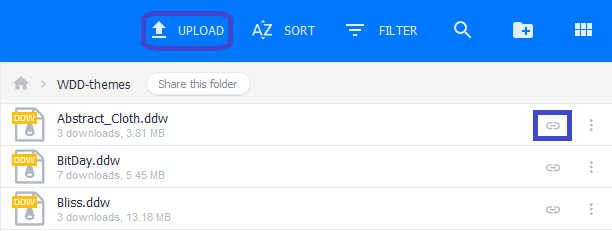

# WDD-website

Website for [WinDynamicDesktop](https://github.com/t1m0thyj/WinDynamicDesktop) hosted on GitHub Pages

## Submit New Themes

### Create and package your theme

Follow the instructions [here](https://github.com/t1m0thyj/WinDynamicDesktop/wiki/Creating-custom-themes) to create your own theme. Then package the images and theme.json file into a ZIP archive.

Rename the file to change the `.zip` extension to `.ddw`. The rest of the filename should equal your theme ID.

Make sure your theme meets the following requirements:

- Theme ID must be unique and can only contain alphanumeric, hyphen (`-`), and underscore (`_`) characters
- Theme package must contain theme.json file at top level
- Theme JSON must include required keys (dayImageList, imageCredits, imageFilename, nightImageList)
- Theme package cannot contain extra files in addition to images and theme.json
- Theme package must include all images referenced in theme.json
- Image size must be at least HD resolution (1920x1080)
- Image ratio must be landscape or square (16:9 is recommended)
- Image shown at noon should be brightest image in the set
- Image shown at midnight should be darkest image in the set
- Image credits must include name of the original artist/photographer

### Publish your theme to MediaFire

Upload your DDW file online for others to download and use in WDD. If you want your theme featured on the [WDD Themes site](https://windd.info/themes/), you must upload your theme to MediaFire.

Sign up for a MediaFire account if you don't have one yet. Then log in to upload a file and copy the share link:

### Submit your theme to the website

Submit your theme using this Google form: https://forms.gle/sxS97seQj4QhKMM48

After submitting your theme it will be automatically scanned. If issues are detected you will receive an email listing the problems found.

Once you receive an email saying your theme has been approved, your theme is ready to be published and a WDD theme reviewer will add it to the [WDD Themes site](https://windd.info/themes/).

## Submit New Scripts

Follow the instructions [here](https://github.com/t1m0thyj/WDD-scripts#create-new-scripts).
